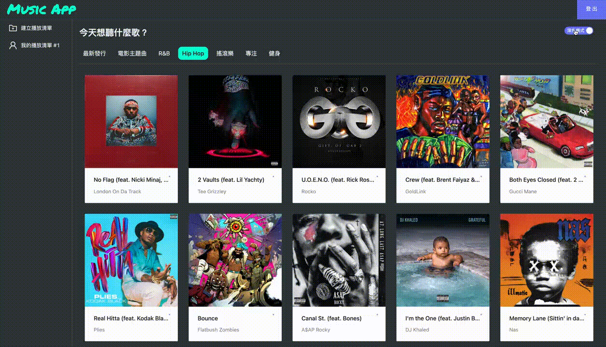
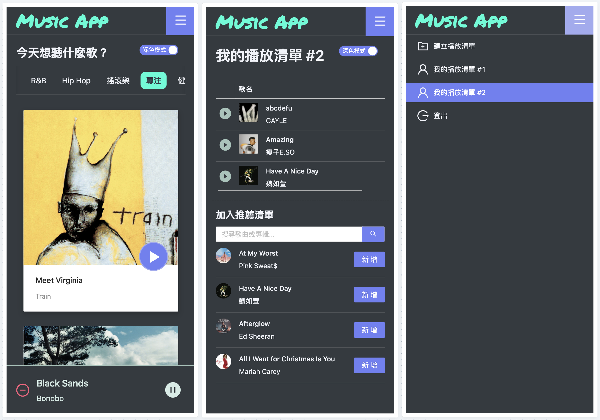

# Project : Music App

### Music App 是使用React Hooks 串接 Spotify API 完成的音樂播放器，包含音樂推薦與建立個人音樂庫。
---
### 使用技術：
- [React Hooks](https://reactjs.org/docs/hooks-reference.html)
- [React Router](https://reactrouter.com/docs/en/v6/api)
- [Redux Toolkit](https://redux-toolkit.js.org/)
- [Typescript](https://www.typescriptlang.org/docs/handbook/2/objects.html)
- [styled-components](https://styled-components.com/)
- UI: [Antd Design](https://ant.design/components/overview/)
- API: [Spotify API](https://developer.spotify.com/console/)


### 功能說明：

- ## Recommendation
    - 切換頁籤，顯示不同類型的音樂推薦。

- ## MyPlayLists
    - 新建個人音樂資料庫
    - 搜尋音樂
    - 新增、移除音樂

- ## PlayBar
    - CurrentPlayingInfo: 目前播放音樂資訊
    - PlayController: 暫停、播放、上一首、下一首
    - VolumeController: 音量控制

- ## RWD 顯示、深淺模式調整

### Demo：



### 專案結構:
```

├── node_modules
├── public
│   └──index.html
└── src
    ├── index.tsx
    ├── App.css 
    ├── App.tsx
    ├── reduxToolkit (管理 共用資料)
    │   ├── index.ts
    │   ├── store.ts
    │   ├── hooks.ts
    │   └── slices
    │       ├── currentUserSlice.ts    (token、個人音樂庫CRUD 等)
    │       └── currentPlayingSlice.ts (PlayBar 播放狀態、playList 等)
    │
    ├── routes      (管理 路徑結構)
    ├── service     (管理 call api 共用funcition 與 401檢查) 
    ├── type        (管理 資料型別定義)
    ├── theme       (管理 深淺模式風格)
    ├── layouts     (管理 排版架構)
    ├── components  (管理 共用元件)
    │
    └── page        (管理 頁面內容)
        ├── login 
        ├── home 
        │   └── recommendation  (推薦音樂)
        └── myPlayLists         (個人音樂庫)

```


